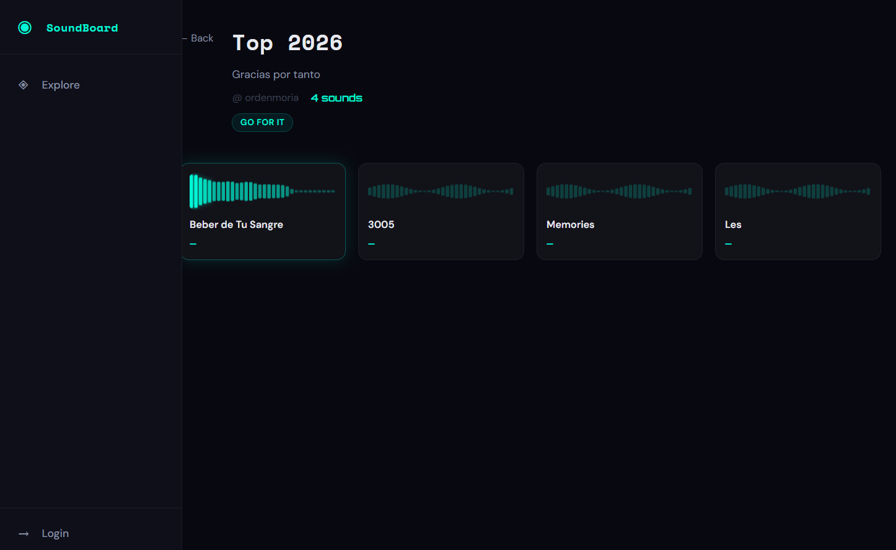

# SoundBoard

A collaborative platform for managing, sharing, and discovering sound effects and audio files.



## Overview

SoundBoard enables users to create and organize soundboards (collections of sounds), upload audio files, share boards publicly or privately, and discover sounds from other users with powerful tagging and search capabilities.

## ✨ Features

- **User Authentication** - Secure registration and login with JWT tokens
- **Board Management** - Create, edit, and delete personal soundboards
- **Audio Upload** - Upload and manage audio files with automatic format handling
- **Public Discovery** - Browse and explore boards shared by other users
- **Search & Filter** - Tag-based search and advanced filtering
- **User Profiles** - Personalized user profiles and settings
- **Real-time Validation** - Instant feedback on form inputs
- **Rate Limiting** - Protects API from abuse

## 🚀 Quick Start

### Prerequisites
- Python 3.9+
- Node.js 18+
- npm

### Backend Setup

```bash
# Create and activate virtual environment
python -m venv venv
source venv/Scripts/activate  # Windows: venv\Scripts\activate

# Install dependencies
pip install -r requirements.txt

# Run the server
uvicorn app.main:app --reload
# Backend available at http://localhost:8000
# API docs at http://localhost:8000/docs
```

### Frontend Setup

```bash
cd frontend

# Install dependencies
npm install

# Start development server
npm run dev
# Frontend available at http://localhost:5173
```

## 📚 Documentation

Comprehensive guides for all aspects of the project:

- **[Development Documentation](./docs/README.md)** - Start here for setup and architecture overview
- **[Backend Development Guide](./docs/BACKEND_DEVELOPMENT.md)** - API structure, endpoints, and patterns
- **[Frontend Development Guide](./docs/FRONTEND_DEVELOPMENT.md)** - Components, state management, and styling
- **[FastAPI Framework Manual](./docs/FASTAPI_FRAMEWORK_MANUAL.md)** - FastAPI concepts and best practices
- **[React & Vite Manual](./docs/REACT_VITE_FRAMEWORK_MANUAL.md)** - React and Vite development guide

## 🏗️ Architecture

```
┌─────────────────────┐
│   Frontend (React)  │  Port 5173
└──────────┬──────────┘
           │ HTTP/REST API
┌──────────▼──────────┐
│  Backend (FastAPI)  │  Port 8000
└──────────┬──────────┘
           │ SQL
┌──────────▼──────────┐
│    SQLite DB        │
└─────────────────────┘
```

**Frontend:** React 18.3 + Vite 5.4 with React Router and CSS Modules  
**Backend:** FastAPI 0.111+ with SQLAlchemy ORM and Pydantic validation  
**Database:** SQLite

## 📁 Project Structure

```
soundboard/
├── app/                    # Backend (FastAPI)
│   ├── main.py            # Application entry point
│   ├── config.py          # Configuration settings
│   ├── schemas/           # Pydantic models
│   ├── models/            # SQLAlchemy models
│   ├── routes/            # API endpoints
│   ├── services/          # Business logic
│   ├── db/                # Database setup
│   └── utils/             # Utilities and helpers
├── frontend/              # Frontend (React + Vite)
│   ├── src/
│   │   ├── pages/         # Page components
│   │   ├── components/    # Reusable components
│   │   ├── context/       # Context API state
│   │   ├── api/           # API client
│   │   └── styles/        # CSS modules
│   └── package.json
├── docs/                  # Comprehensive documentation
├── tests/                 # Test suite
└── requirements.txt       # Python dependencies
```

## 🛠️ Common Tasks

### Adding a New API Endpoint

See [Backend Development Guide](./docs/BACKEND_DEVELOPMENT.md#adding-a-new-endpoint)

### Adding a New Page/Component

See [Frontend Development Guide](./docs/FRONTEND_DEVELOPMENT.md#adding-a-new-page)

### Understanding API Errors

See [Frontend Development Guide](./docs/FRONTEND_DEVELOPMENT.md#error-handling)

### Working with State

See [React Manual](./docs/REACT_VITE_FRAMEWORK_MANUAL.md#hooks-for-state--effects)

## 🐛 Known Issues

See [CLAUDE.md](./CLAUDE.md#known-issues) for current issues and their status.

## 📝 Development Workflow

1. **Create a feature branch** for your work
2. **Make changes** following the architecture guides
3. **Test thoroughly** - test the golden path and edge cases
4. **Update documentation** if needed
5. **Create a PR** with a clear description of changes

## 🤝 Contributing

When adding new features or making significant changes:

1. Update relevant documentation in `docs/`
2. Add code examples and comments for complex logic
3. Include screenshots/diagrams for UI changes
4. Test backend endpoints in Swagger UI (`/docs`)
5. Verify frontend changes in browser

## 🔗 Resources

- [FastAPI Documentation](https://fastapi.tiangolo.com/)
- [React Documentation](https://react.dev/)
- [Vite Documentation](https://vitejs.dev/)
- [React Router Documentation](https://reactrouter.com/)
- [SQLAlchemy Documentation](https://docs.sqlalchemy.org/)

## 📊 Project Status

**Version:** 2.0.0  
**Last Updated:** 2026-04-17

**✅ Completed Features:**
- User registration and authentication
- Board creation and management
- Sound file upload and streaming
- Public board browsing
- Tag-based searching and filtering
- User profiles
- Real-time validation feedback
- Rate limiting

## 📧 Support

For questions or issues, see the [troubleshooting guide](./docs/README.md#troubleshooting) in the documentation.

---

**Development Team** | [View Documentation](./docs/README.md)
